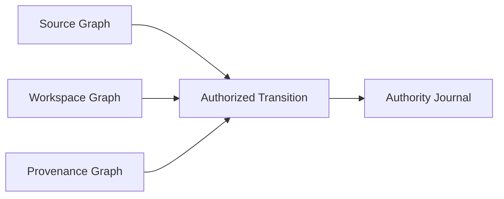

# State Fabric v0.1 Protocol

## Canonical model

State Fabric has three immutable graphs and one signed journal:



Git is projected into the Source Graph. Complete filesystem state is projected
into the Workspace Graph. Agent instructions and evidence live in the
Provenance Graph.

## Canonical bytes

v0.1 uses `fabric-json-v0`:

- UTF-8 JSON;
- fixed struct field order;
- no maps, floats, unknown fields, or insignificant whitespace;
- HTML escaping disabled;
- byte slices use standard JSON base64 encoding;
- sorted and unique link, parent, operation, and ref lists.

SHA-256 identities and Ed25519 signatures cover these exact bytes. Golden-vector
tests protect encoding stability.

## Objects

Public:

```text
obj:sha256:<digest of canonical GraphObject>
```

Private:

```text
priv:<trust-domain>:1:<HMAC(domain identity key, canonical digest)>
```

Objects are written using temp-file, file fsync, atomic rename, and directory
fsync before they may contribute to a durability receipt.

## Transition

A signed transition binds:

- namespace and trust domain;
- causal parent transitions;
- expected prior ref;
- Source, Workspace, and Provenance roots;
- required-object manifest;
- one v0.1 ref intent;
- actor public key;
- signed capability;
- optional policy context.

The edge verifies the transition ID, actor signature, capability, manifest, and
complete recursive object closure before persisting the transition.

## Edge receipt

The signed receipt binds:

- transition ID;
- accepting node;
- acceptance time;
- durability class;
- object manifest.
- the latest Authority Journal checkpoint observed by the edge.

v0.1 advertises `host-disk`. It means all required objects, the transition, the
receipt, and the accepted journal event were fsynced before the receipt was
returned.

The actor may self-accept locally. A distinct edge may instead accept on the
actor's behalf when the authority has issued that edge a namespace-scoped
`receipt.issue` capability. The receipt binds the acceptance-capability ID,
accepting node identity, durability class, object manifest, and latest observed
Authority Journal checkpoint.

## Authority journal

The journal is append-only canonical JSONL. Every record includes:

- sequence;
- previous record ID;
- event type;
- namespace/ref/transition;
- result;
- authority signature.

Ref state is rebuilt only from journal replay. Snapshots are not authoritative.
Each journal also persists its expected head in a separately fsynced sidecar.
Reloads must extend that checkpoint, so replacing the JSONL with an older valid
signed prefix is rejected. Hostile rollback of both files requires an external
witness or hardware-backed monotonic checkpoint and remains deferred.

## Conflict behavior

Finalization performs a compare-and-set against the transition's expected ref.
The per-node finalization lock serializes the check and journal append.

If the expected value is stale:

- the transition is not overwritten or deleted;
- a signed `divergent` record is appended;
- a stable `refs/divergent/.../<transition-prefix>` name is created;
- a later merge transition may reference both parents.

Wall-clock timestamps never select a winner.

## Replication

`fabric sync` recursively sends:

1. causal parent transitions and their receipts;
2. each complete required-object closure;
3. the requested transition and its durability receipt.

The receiving node recalculates every object and transition identity, verifies
signatures and capability, and only then persists the state.

Edges mirror the authority journal as a verified prefix. A history fork is
rejected rather than silently replaced.

## Explicit v0.1 limits

- One authority per trust domain.
- One `set` ref intent per transition.
- Cross-process journal locking is implemented on macOS and Linux; Windows is
  deferred.
- Peer transport uses a shared domain credential. TLS 1.3 with an explicit CA is
  supported, but per-node mTLS identity is deferred.
- Git adapter snapshots and exports tracked files; it is not yet a full Git
  smart-protocol server. Git SHA-1 and SHA-256 object formats are supported.
  Tracked blobs larger than 32 MiB are rejected before snapshot publication
  because v0.1 does not yet stream source objects.
- Every canonical graph-object envelope is capped at 48 MiB so locally accepted
  objects always fit within the authenticated v0.1 JSON replication transport.
- Git and workspace paths must be valid UTF-8 in v0; unsupported paths are
  rejected rather than lossy-normalized.
- Workspace snapshots use content-defined chunks and layered persisted-filesystem
  roots; live demand-paged mounts are not yet implemented.
- Offline reachability GC retains every object referenced by a persisted
  transition and only selects unreachable objects older than an explicit grace
  period. Run destructive GC with the node daemon stopped.
- No live demand-paged mount, placement prediction, transparency witnesses, or
  semantic merge engine.
